# CloudDisk

基于QT、Flask和React实现的桌面和网页端云网盘工具

## 云网盘工具

- 课程实现工程：提交在git的Master分支延伸出的的CloudDisk_noencrypt分支上，后与master分支合并，master早期的提交为前后端搭建的网课内容

- 项目功能：

    1. 目录可以嵌套，数据库中目录和文件包括父级目录信息；
    2. 文件可以以真实名称保存，可以通过硬盘访问，也可以通过配置使用加密方式保存
    3. 文件和文件夹都可以进行分享使用
    4. 文件下载通过http下载
    5. 文件夹下载通过QT桌面客户端方式（待开发）
    6. 可以检测硬盘文件、文件夹内容改变（待开发）

- 项目技术：

    1. 使用了React前端框架和Flask基于Python的后台开发框架
    2. ORM层使用了peewee与sqlite数据库通信
    3. 使用token机制和cookie实现验证   

- 展示：

    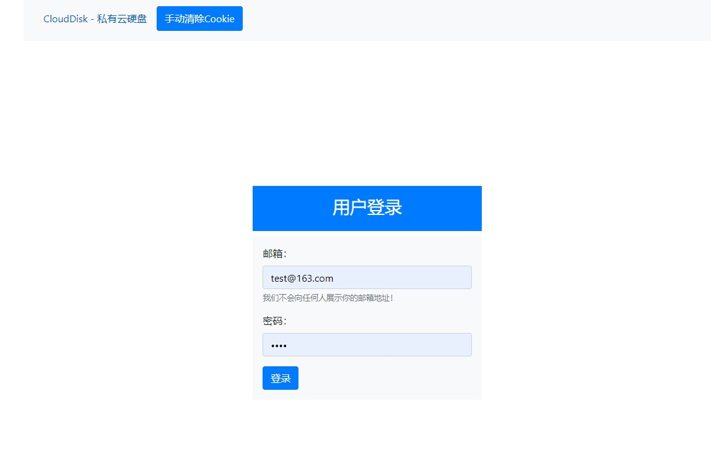

    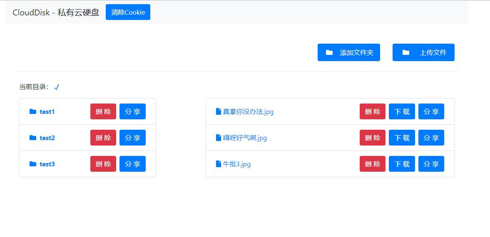

    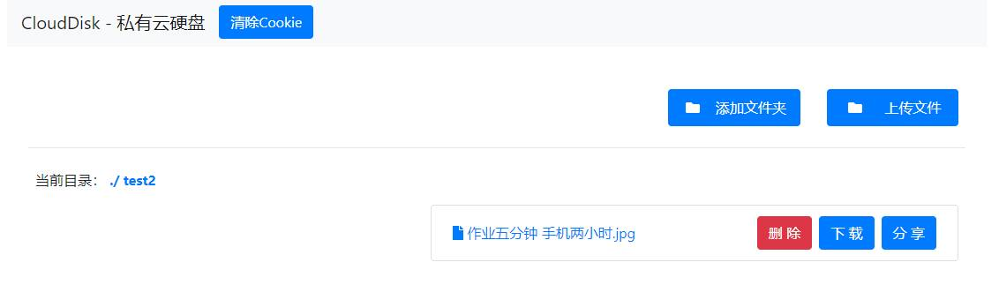

    

    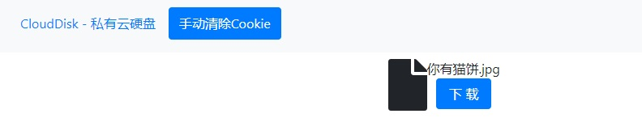

    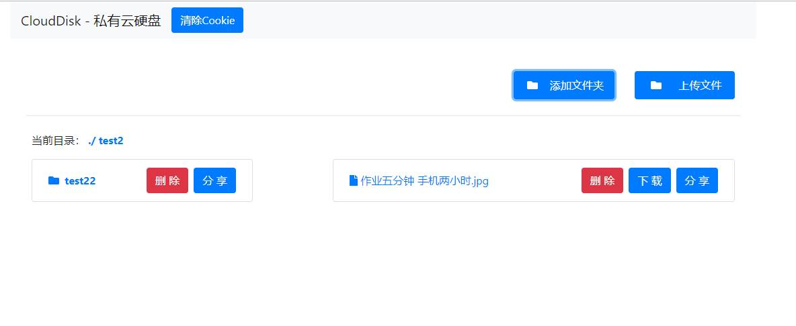

    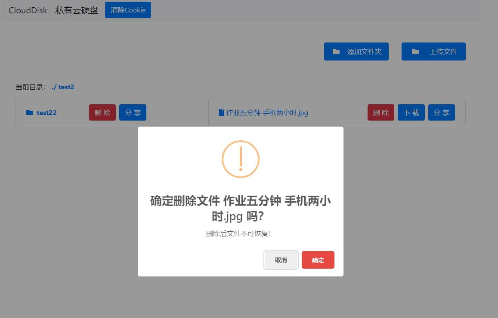

    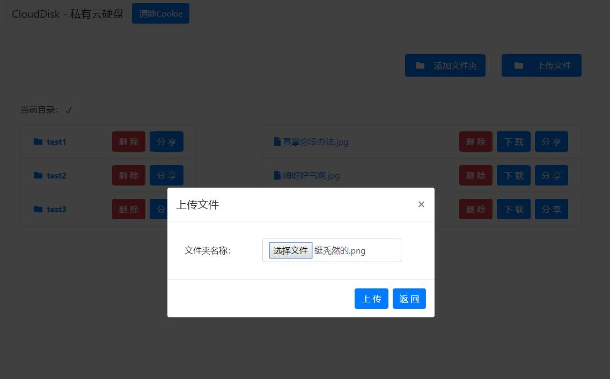

- 使用步骤：
    - 后台Flask：

        1. 需要安装好Pycharm
        2. 使用Pycharm打开server文件夹的项目
        3. 可以新建一个本地的venv环境，也可使用全局的python解释器

        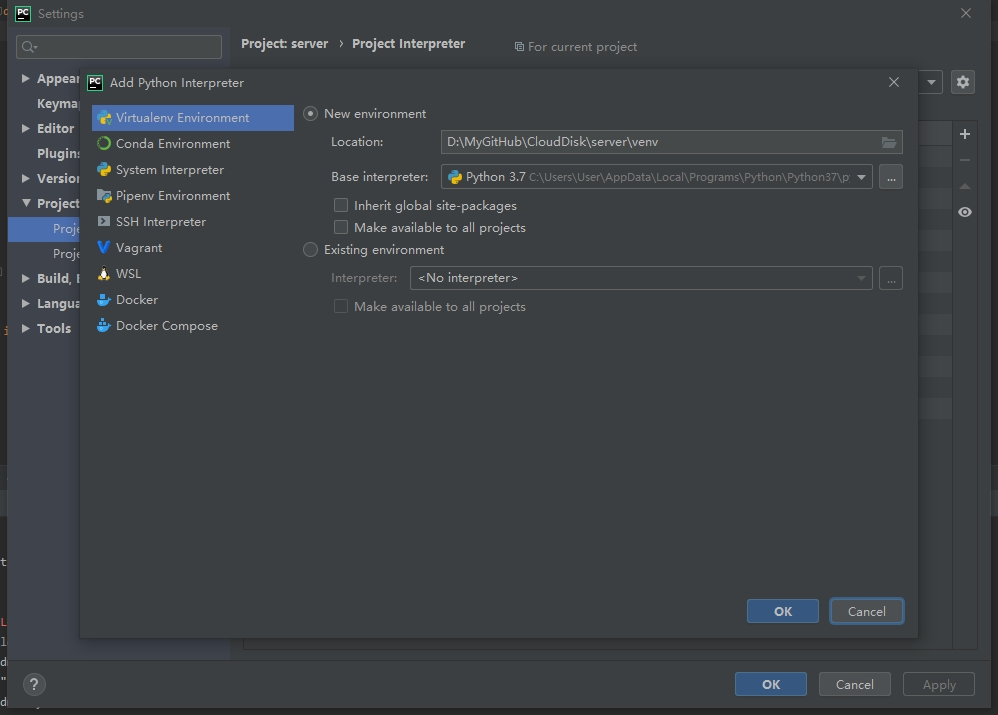

        4. 之后安装被标记的未安装的依赖，注意可能需要更换源

        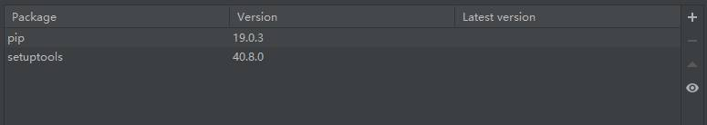

        

        5. flask相关配置在config.py文件里，目前登录账号和密码是写死的，其他内容里面有注释
        6. 运行DBCreate.py建立数据库，在根目录下新建upload文件夹

        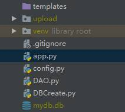

        7. 需要修改app的运行目录，以使其可以访问创建的数据库文件

        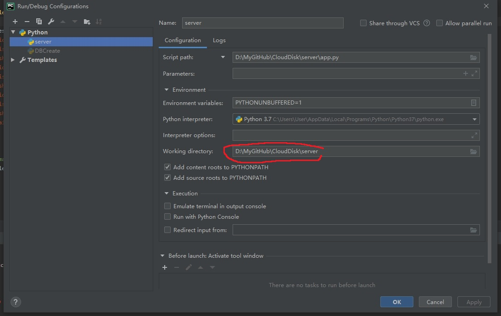

        8. 可以直接运行app.py，因为static文件夹包含了已经部署好的前端代码，浏览器输入localhost:5000进入主页；账号是test@163.com，密码是test

    - 前端React：

        1. 安装好Idea
        2. 需要用到npm，可以安装node.js，此项目使用的是v10.16.3版本；
        3. 使用Idea打开app路径下的项目
        4. 需要配置好npm，配置编译环境，点击Add Configuration，再点击加号，添加npm，在右边scripts填入'start'

        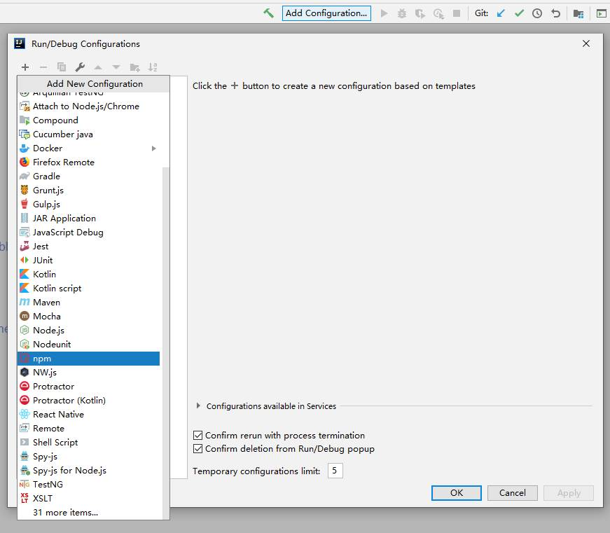

        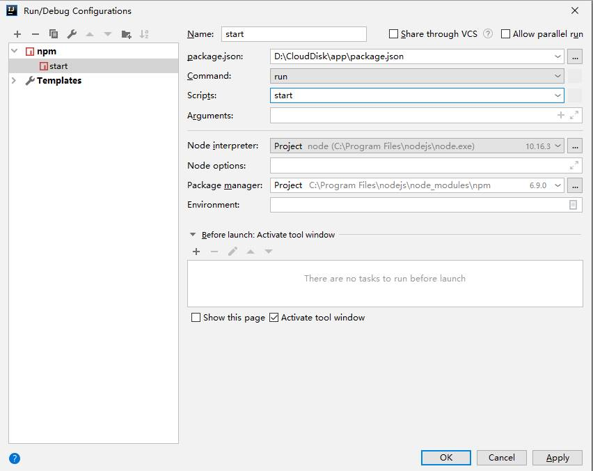

        5. 点击右下方的npm install安装依赖，有些依赖可能需要手动安装，在命令行输入`npn install --save '依赖库名'`进行安装，如果中途安装长时间卡住，可能是内网的原因，可以改用cnpm，推荐使用代理，方法：[https://www.cnblogs.com/wenbinjiang/p/11062959.html](https://www.cnblogs.com/wenbinjiang/p/11062959.html)

        

        6. 开启后台服务器后可以使用前端访问
